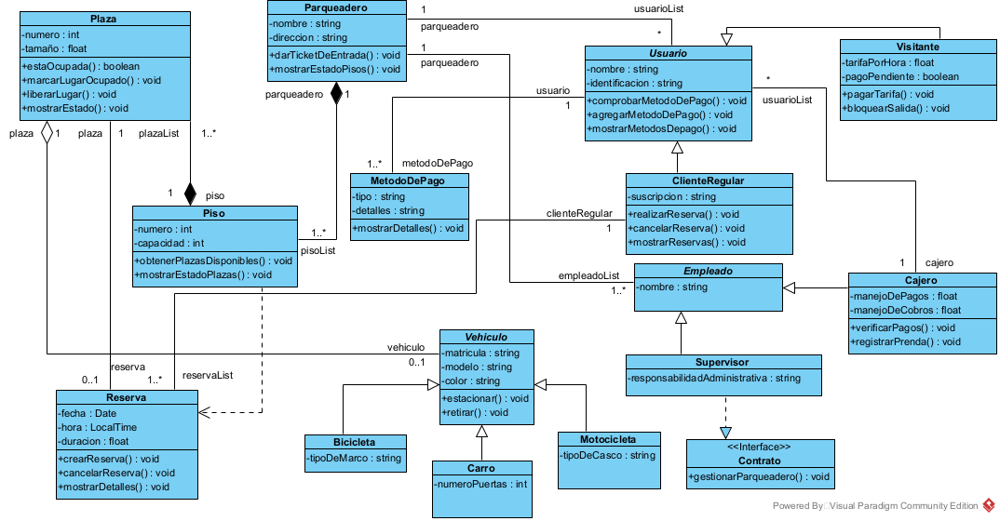

# parqueadero

DIAGRAMA UML PARQUEADERO

DIAGRAMA UML PARQUEADERO CON CAMBIOS V2 

DIAGRAMA UML PARQUEADERO CON CAMBIOS V3 

Los cambios realizados son los siguientes: 

Se corrigio la falta tipo de variable en los atributos de cajero.

Se agregaron dos metodos a la clase usuario para mostrar con mas detalle la informacion de el metodo de pago.

se agrego un metodo a la clase ClienteRegular para poder mostrar las reservas realizadas.

Se agrego un metodo a la clase Parqueadero para poder mostrar los pisos del Parqueadero.

Se agrego un metodo a la clase MetodoDePago para mostrar detalles. 

Se agrego un metodo a la clase Piso para mostrar el estado de las plazas. 

Se cambio el tipo del atributo hora de la clase Reserva para poder mostrar solamente la hora sin incluir la fecha.

Se corrigio el rol de la relacion de asociacion entre Reserva y ClienteRegular porque era necesario mostrar que puede haber mas de una reserva.

